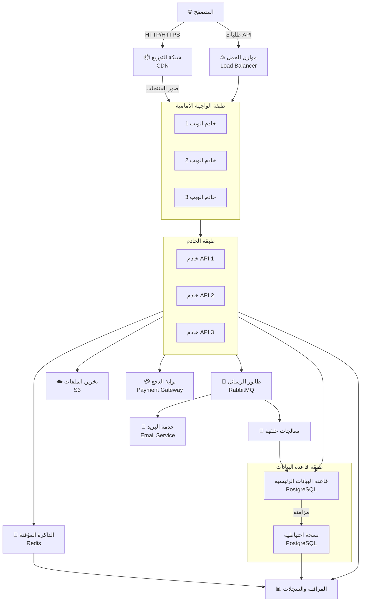
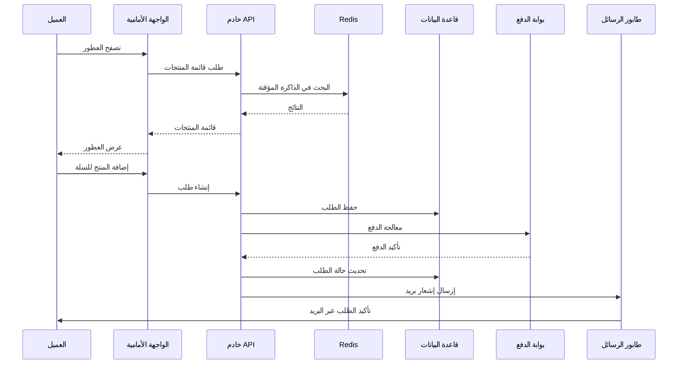

# معمارية تطبيق متجر العطور - GOLDEN GRASS PARFUM

## نظرة عامة على النظام

## المكونات الرئيسية

### 🎨 طبقة الواجهة الأمامية (Frontend Layer)
- **خوادم الويب**: تقديم المحتوى الثابت وصفحات المتجر
- **شبكة التوزيع (CDN)**: توزيع صور العطور والموارد على مستوى عالمي بسرعة عالية

### 🔧 طبقة الخادم (Backend Layer)
- **خوادم API**: معالجة منطق الأعمال وطلبات العملاء
- **موازن الحمل**: توزيع حركة المرور عبر خوادم API متعددة

### 💾 طبقة الذاكرة المؤقتة (Cache Layer)
- **Redis**: تخزين بيانات المنتجات والجلسات بسرعة عالية

### 🗄️ طبقة قاعدة البيانات (Database Layer)
- **قاعدة البيانات الرئيسية**: PostgreSQL لتخزين بيانات المنتجات والعملاء والطلبات
- **النسخة الاحتياطية**: قاعدة بيانات نسخة للقراءة فقط لتوزيع الحمل

### 🔄 الخدمات الإضافية
- **طابور الرسائل**: RabbitMQ لمعالجة المهام غير المتزامنة
- **معالجات الخلفية**: معالجة الطلبات المطبوعة والتقارير
- **تخزين الملفات**: S3 لتخزين صور العطور والملفات
- **بوابة الدفع**: معالجة عمليات الدفع بأماناً
- **خدمة البريد**: إرسال تأكيدات الطلبات والإشعارات
- **المراقبة والسجلات**: تتبع أداء النظام والأخطاء

## تدفق عملية الشراء

## متطلبات الأمان

- ✅ تشفير البيانات (HTTPS/TLS)
- ✅ مصادقة آمنة (JWT/OAuth2)
- ✅ حماية من هجمات CSRF و XSS
- ✅ تشفير بيانات بطاقات الائتمان (PCI DSS)
- ✅ النسخ الاحتياطية المنتظمة
- ✅ مراقبة الأمان والتنبيهات

## قابلية التوسع

- 📈 تحميل متوازن لمعالجة ملايين الطلبات
- 🔁 قاعدة بيانات قابلة للتوسع مع النسخ الاحتياطية
- ⚡ ذاكرة مؤقتة لتحسين الأداء
- 🌍 توزيع عالمي عبر CDN
- 📊 معالجة غير متزامنة للمهام الثقيلة
